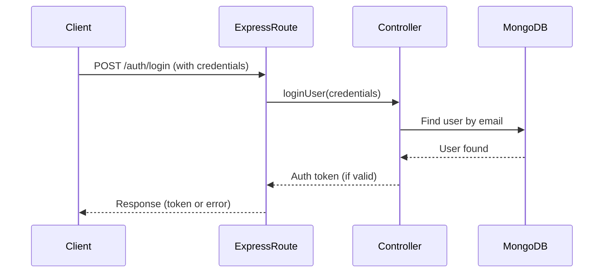

# Auth Routes Overview

## /auth/login (User Login)

```mermaid
sequenceDiagram
    participant Client
    participant ExpressRoute
    participant Controller
    participant MongoDB

    Client->>ExpressRoute: POST /auth/login (with credentials)
    ExpressRoute->>Controller: loginUser(credentials)
    Controller->>MongoDB: Find user by email
    MongoDB-->>Controller: User found
    Controller-->>ExpressRoute: Auth token (if valid)
    ExpressRoute-->>Client: Response (token or error)
```

**Description:**
- Handles user login and returns an authentication token if credentials are valid. 