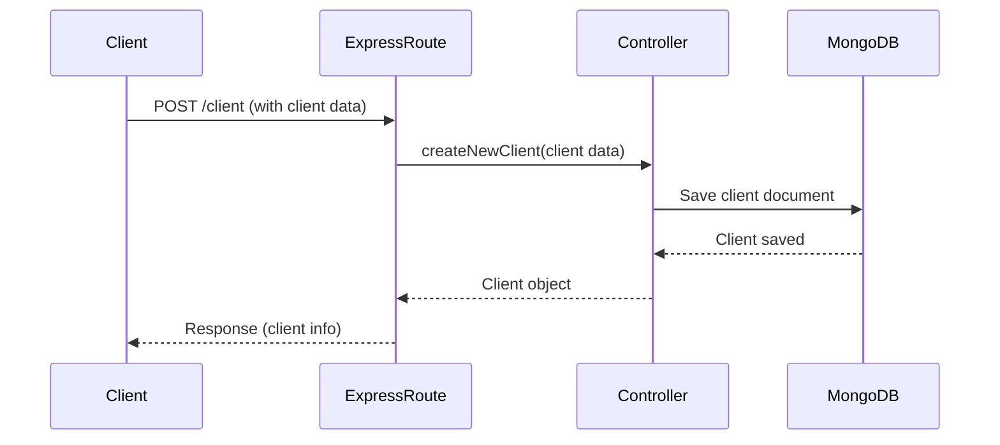

# Client Routes Overview

## /client (Add Client)

```mermaid
sequenceDiagram
    participant Client
    participant ExpressRoute
    participant Controller
    participant MongoDB

    Client->>ExpressRoute: POST /client (with client data)
    ExpressRoute->>Controller: createNewClient(client data)
    Controller->>MongoDB: Save client document
    MongoDB-->>Controller: Client saved
    Controller-->>ExpressRoute: Client object
    ExpressRoute-->>Client: Response (client info)
```

**Description:**
- Handles client creation and saves the client document in the database. 