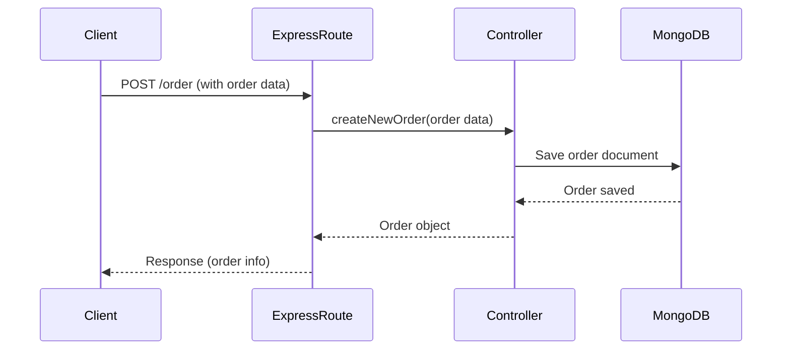

# Order Routes Overview

## /order (Add Order)

```mermaid
sequenceDiagram
    participant Client
    participant ExpressRoute
    participant Controller
    participant MongoDB

    Client->>ExpressRoute: POST /order (with order data)
    ExpressRoute->>Controller: createNewOrder(order data)
    Controller->>MongoDB: Save order document
    MongoDB-->>Controller: Order saved
    Controller-->>ExpressRoute: Order object
    ExpressRoute-->>Client: Response (order info)
```

**Description:**
- Handles order creation and saves the order document in the database. 