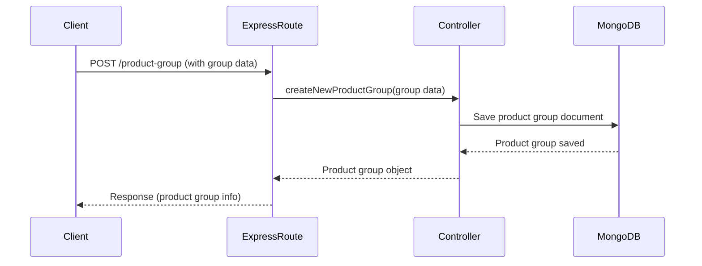

# Product Group Routes Overview

## /product-group (Add Product Group)

```mermaid
sequenceDiagram
    participant Client
    participant ExpressRoute
    participant Controller
    participant MongoDB

    Client->>ExpressRoute: POST /product-group (with group data)
    ExpressRoute->>Controller: createNewProductGroup(group data)
    Controller->>MongoDB: Save product group document
    MongoDB-->>Controller: Product group saved
    Controller-->>ExpressRoute: Product group object
    ExpressRoute-->>Client: Response (product group info)
```

**Description:**
- Handles product group creation and saves the product group document in the database. 