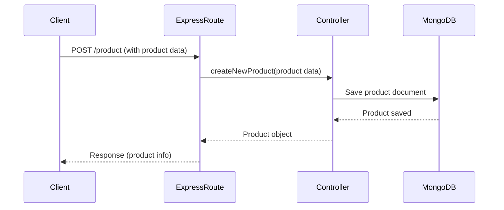

# Product Routes Overview

## /product (Add Product)

```mermaid
sequenceDiagram
    participant Client
    participant ExpressRoute
    participant Controller
    participant MongoDB

    Client->>ExpressRoute: POST /product (with product data)
    ExpressRoute->>Controller: createNewProduct(product data)
    Controller->>MongoDB: Save product document
    MongoDB-->>Controller: Product saved
    Controller-->>ExpressRoute: Product object
    ExpressRoute-->>Client: Response (product info)
```

**Description:**
- Handles product creation and saves the product document in the database. 