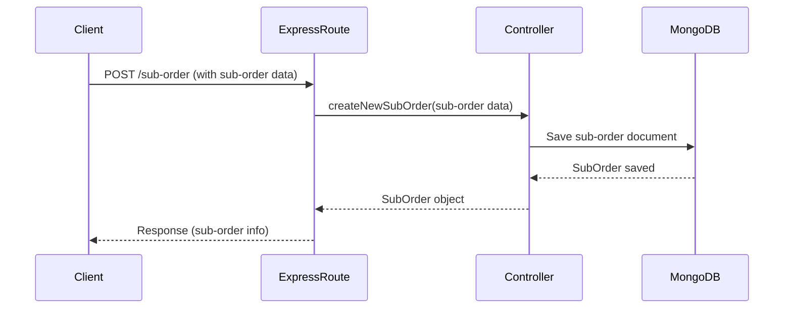

# SubOrder Routes Overview

## /sub-order (Add SubOrder)

```mermaid
sequenceDiagram
    participant Client
    participant ExpressRoute
    participant Controller
    participant MongoDB

    Client->>ExpressRoute: POST /sub-order (with sub-order data)
    ExpressRoute->>Controller: createNewSubOrder(sub-order data)
    Controller->>MongoDB: Save sub-order document
    MongoDB-->>Controller: SubOrder saved
    Controller-->>ExpressRoute: SubOrder object
    ExpressRoute-->>Client: Response (sub-order info)
```

**Description:**
- Handles sub-order creation and saves the sub-order document in the database. 