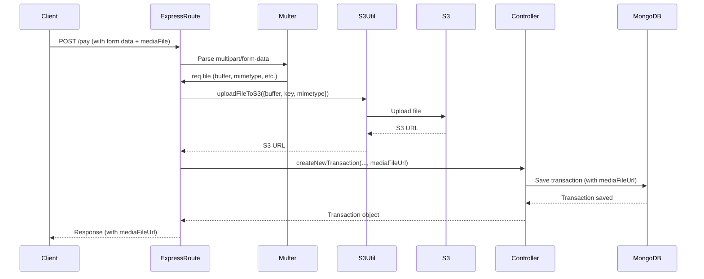

# Transaction Routes Overview

## /pay (Add Transaction with Media Upload)

**Description:**
- Handles transaction creation and optional media file upload to S3.
- Stores the S3 file URL in the transaction document. 